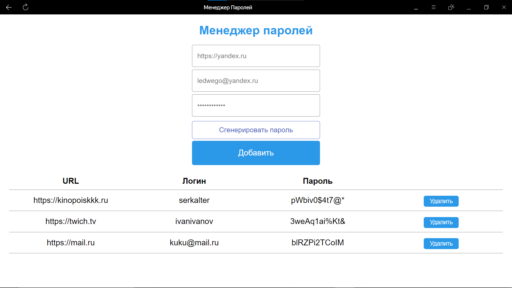
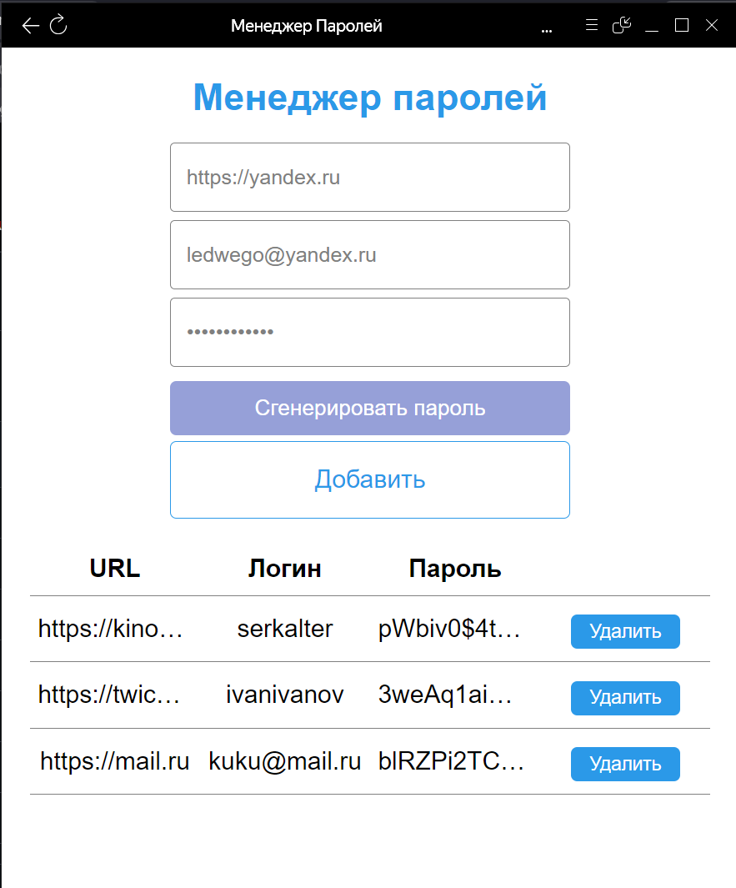
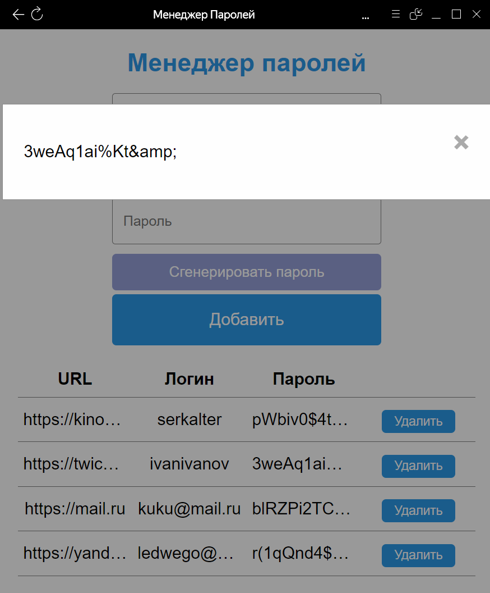

# **Менеджер паролей**
Проект представляет из себя прогрессивное веб-приложение (PWA) для хранения логинов и паролей к используемым ресурсам.

Шаблон HTML-странцы представлен в файле `index.html`, стили описаны в `style.css`, основные исполняемые скрипты находятся в `script.js`.

## Установка
Для того чтобы проверить работоспособность приложения необходмо скачать и сохранить в одном каталоге следующие файлы:
+ `index.html`
+ `style.css`
+ `script.js`
+ `manifest.json`
+ `service-worker.js`
+ `icon-512x512.png`
+ `icon-192x192.png`

Далее в этом каталоге необходимо запустить собственный http-server.

> [!NOTE]
> Пример запуска простого http-сервера: `python -m http.server 80 --bind 0.0.0.0`
  
## Использование
Веб-интерфейс будет доступен по адресу `http://localhost`, некоторые браузеры сразу предложат установить приложение и добавить ярлык на рабочий стол, в случае если этого не произойдет, сделайте это самостоятельно в настройках вашего браузера.

Функционал приложения:
+ Форма для добавления новых паролей
+ Кнопка генерации надежного пароля
+ Таблица, содержащая записи о добавленных паролях
+ Кнопки удаления определенных записей в самой таблице

> [!NOTE]
> Длинные записи будут сокращаться, посмотреть содержимое целиком можно кликнув по ячейке таблицы.

Демонстрация приложения:

   
  

